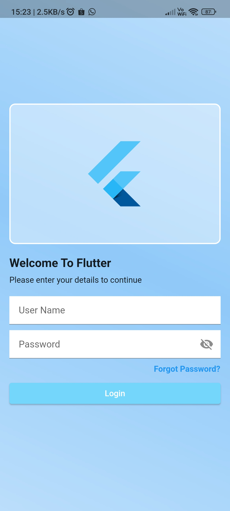
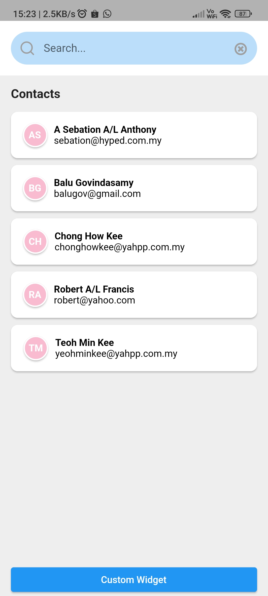
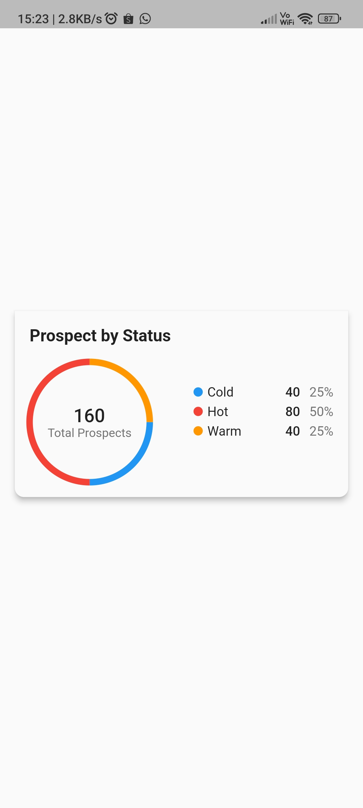

# Contacts

1 UI/Presentation 
  ✅ login 
  ✅ contacts list  
  ✅ search with highlight 

2 APIs Integration 
✅ API call using Dio 
✅ sort by alphabetical order 
✅ search by name or email 

3 Custom Widget 
✅ circle with multiple color 
✅ separate reusable widget 

4 Code Review 
✅ added comment block on the code code_review.dart 

extra informations
1. This Flutter app is built using Flutter version 3.13.0
2. There is a sample Android APK heres [apk-release.apk](https://github.com/lovaicv/contact-book/blob/master/app-release.apk)
3. question 4 code review here [lib/code_review.dart](https://github.com/lovaicv/contact-book/blob/master/lib/code_review.dart) 
   3.1 the code review is written in comment line with todo (yellow color) for better viewing 
